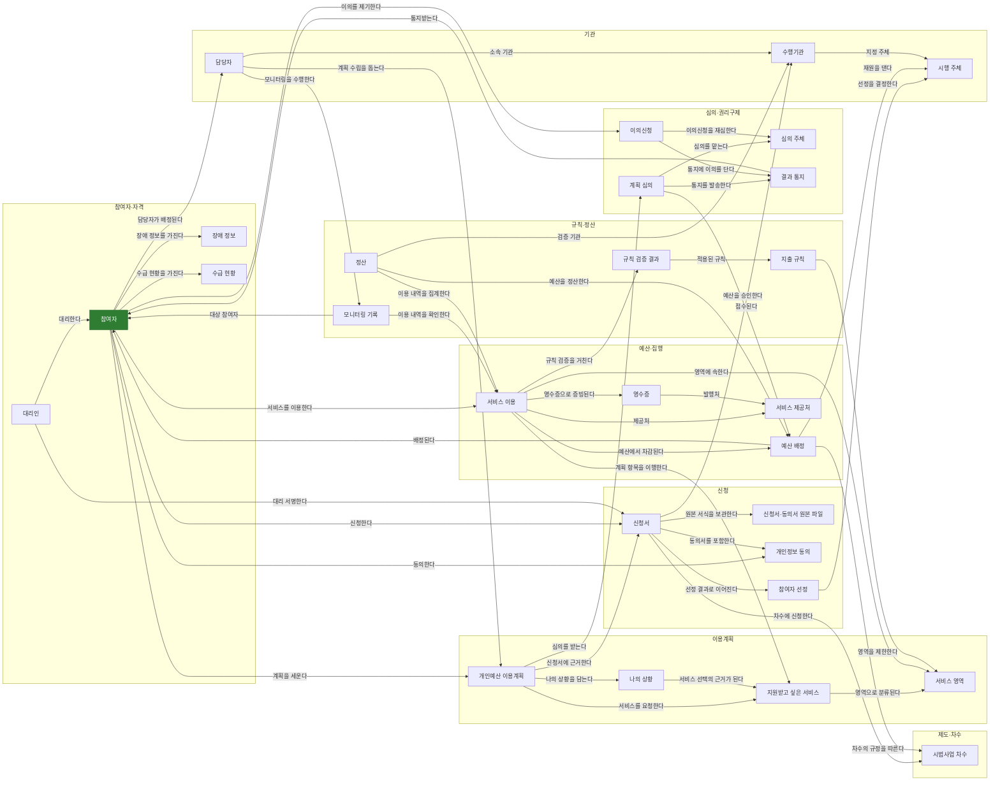
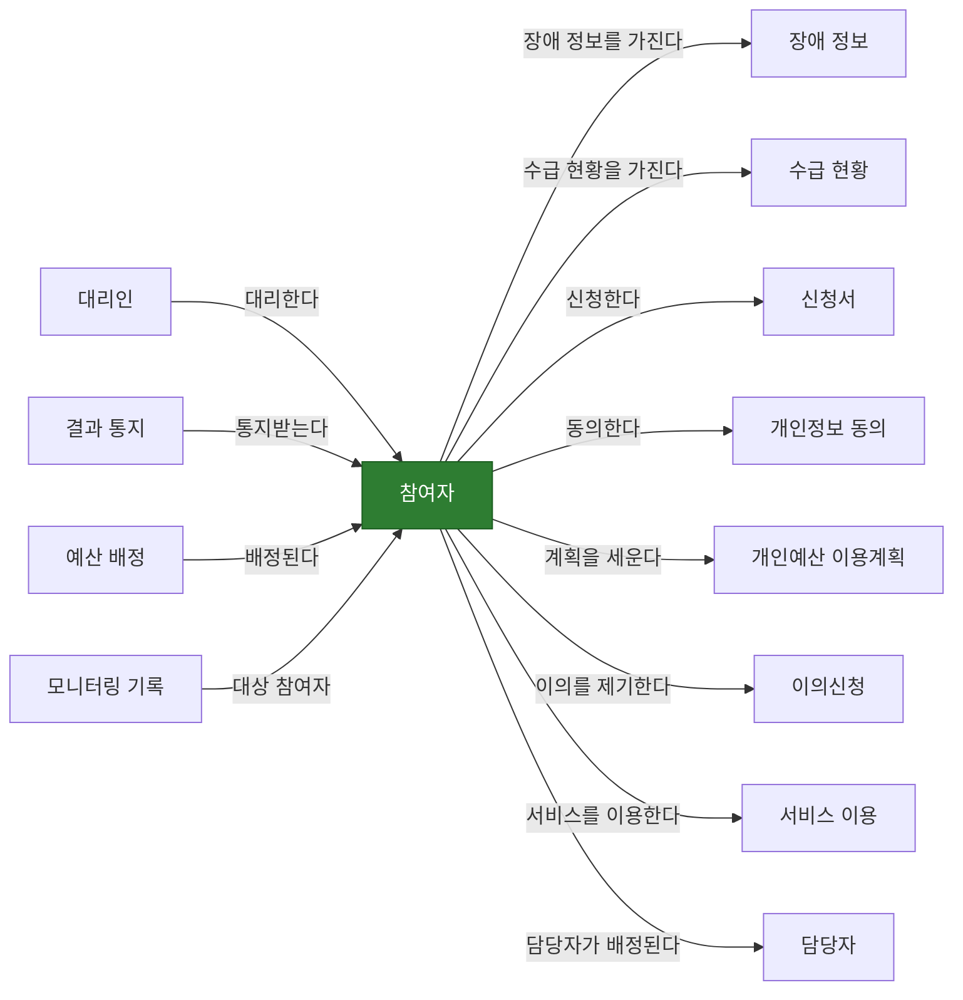
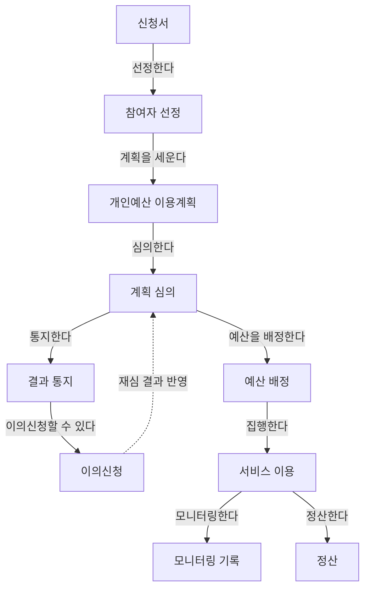

# 서울형 개인예산제 온톨로지 — 한글 관계도

> 이 파일은 `make_diagram.py` 가 `seoul_ontology.rdf` 에서 자동 생성합니다. 직접 고치지 마세요.
> RDF 가 정본이고 이 문서는 사람이 읽기 위한 투영입니다.

Ontology Playground 는 이름이 ASCII 로 시작·끝나고 26자 이내여야 해서 한글 이름을 받지 않습니다.
그래서 RDF 라벨은 영문으로 두고, 한글 그림은 여기서 봅니다.

---

## 전체 관계도

---

## 당사자 중심으로 본 그림

신청·동의·계획수립·이용·이의신청이 모두 당사자에서 출발합니다.
이 방향이 곧 개인예산제의 전제입니다 — 당사자가 스스로 계획하고 선택하고 구매한다.

---

## 절차 흐름 (신청부터 정산까지)

---

## 각 개체가 기록하는 것

### 제도·차수

**시범사업 차수** `Cohort`

- 차수 코드 `cohortCode`
- 차수 이름 `cohortName`
- 지원 개월수 `cohortPeriodMonths`
- 월 한도 기본값 `cohortMonthlyCeiling`
- 총 한도 기본값 `cohortTotalCeiling`
- 월 미사용액 이월 허용 `cohortCarryOver`
- 본인부담률 `copayRate`
- 본인부담금 상한 `copayMax`
- 이의신청 기한 일수 `appealDueDays`

### 참여자·자격

**참여자** `Participant`

- 참여자 명 `participantName`
- 생년월일 `birthDate`
- 성별 `gender`
- 주민등록상 주소 `registeredAddress`
- 실거주지 `actualAddress`
- 연락처 `contactNumber`
- 비상연락망 `emergencyContact`

**대리인** `Proxy`

- 대리인 성명 `proxyName`
- 신청자와의 관계 `relationToParticipant`

**장애 정보** `DisabilityProfile`

- 주장애유형 `primaryDisabilityType`
- 장애정도 `disabilitySeverity`
- 중복장애유형 `secondaryDisabilityType`
- 중도장애 발생시기 `acquiredDisabilityAge`

**수급 현황** `BenefitStatus`

- 공공부조 수급현황 `publicAssistance`
- 활동지원서비스 이용여부 `usesActivitySupport`
- 서울시 활동지원 추가지원 이용여부 `usesSeoulAdditionalSupport`
- 보건복지부 시범사업 참여여부 `participatesInMohwPilot`

### 신청

**신청서** `Application`

- 접수번호 `receiptNumber`
- 신청일 `applicationDate`
- 신청자 서명 `applicantSignature`

**신청서·동의서 원본 파일** `ApplicationDocument`

- 서류 종류 `docType`
- 파일 이름 `docFileName`
- 저장 경로 `docStoragePath`

**개인정보 동의** `ConsentRecord`

- 동의 종류 `consentType`
- 동의 여부 `isAgreed`
- 동의일 `consentDate`
- 대리 서명 여부 `signedByProxy`
- 보유·이용기간 `retentionPeriodNote`
- 동의 철회일 `withdrawnAt`

**참여자 선정** `SelectionDecision`

- 선정 여부 `isSelected`
- 선정·미선정 사유 `selectionReason`
- 선정일 `selectionDate`

### 이용계획

**개인예산 이용계획** `UtilizationPlan`

- 계획 상태 `planStatus`
- 이용 시작일 `planPeriodStart`
- 이용 종료일 `planPeriodEnd`
- 작성 지원 수준 `authoredWithSupport`

**나의 상황** `SelfNarrative`

- 나의 재능·강점·기술 `strengthsTalents`
- 장애로 인한 사회적 제한·어려움 `socialBarriers`
- 내가 원하는 변화와 지원 `desiredChange`
- 내가 원하는 삶의 모습 `desiredLife`
- 시도하고 싶은 것 `goalToTry`
- 1인칭 작성 여부 `writtenInFirstPerson`

**지원받고 싶은 서비스** `RequestedService`

- 우선순위 `servicePriority`
- 서비스 명 `serviceName`
- 예상 비용 `estimatedCost`
- 심의 승인 여부 `approvedForService`

**서비스 영역** `ServiceDomain`

- 영역 코드 `domainCode`
- 영역 이름 `domainLabel`
- 영역 설명 `domainDescription`

### 심의·권리구제

**계획 심의** `PlanReview`

- 심의 결정 `reviewDecision`
- 결정 사유 `reviewReason`
- 심의일 `reviewDate`

**심의 주체** `ReviewCommittee`

- 위원회명 `committeeName`

**결과 통지** `Notification`

- 통지일 `notifiedOn`
- 통지 방법 `notificationMethod`
- 참여자 확인 여부 `isReadByParticipant`

**이의신청** `Appeal`

- 이의신청일 `appealFiledOn`
- 이의 사유 `appealGround`
- 본인 제기 여부 `appealFiledBySelf`
- 처리 기한 `appealDueOn`
- 이의신청 결과 `appealOutcome`

### 예산·집행

**예산 배정** `BudgetAllocation`

- 총 한도액 `totalCeiling`
- 월 한도액 `monthlyCeiling`
- 지원 개월수 `periodMonths`
- 이월 허용 여부 `carryOverAllowed`
- 승인금액 `allocatedAmount`
- 본인부담금 `copayAmount`
- 부담금 상태 `copayStatus`

**서비스 이용** `ServiceUsage`

- 이용일 `usageDate`
- 이용 금액 `usageAmount`
- 이용 내용 `usageDescription`
- 결정 주체 `decidedBySelf`
- 정산 상태 `settlementStatus`

**영수증** `Receipt`

- 영수증 저장 경로 `receiptStoragePath`
- 영수증 발행일 `receiptIssuedOn`
- 영수증 금액 `receiptAmount`

**서비스 제공처** `ServiceProvider`

- 제공처 이름 `providerName`
- 사업자등록번호 `businessNumber`

### 규칙·정산

**지출 규칙** `SpendingRule`

- 규칙 종류 `ruleKind`
- 규칙 이름 `ruleLabel`
- 근거 `ruleSourceNote`
- 적용 방식 `ruleEnforcement`

**규칙 검증 결과** `RuleCheck`

- 검증 결과 `checkResult`
- 실무자 최종 판단 `humanDecision`
- 판단 사유 `humanDecisionReason`

**정산** `Settlement`

- 정산 대상 기간 `settledPeriod`
- 인정액 `acceptedAmount`
- 불인정액 `rejectedAmount`
- 환수액 `recoveredAmount`
- 미사용액 `unusedAmount`

**모니터링 기록** `MonitoringRecord`

- 모니터링 일자 `monitoringDate`
- 확인 방법 `monitoringMethod`
- 관찰된 변화 `observedChange`
- 참여자가 한 말 `participantVoice`

### 기관

**시행 주체** `AdministeringBody`

- 기관명 `bodyName`
- 역할 `bodyRole`

**수행기관** `ExecutingAgency`

- 수행기관명 `agencyName`

**담당자** `Caseworker`

- 담당자명 `caseworkerName`

