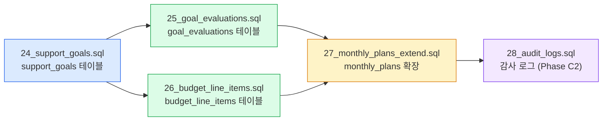
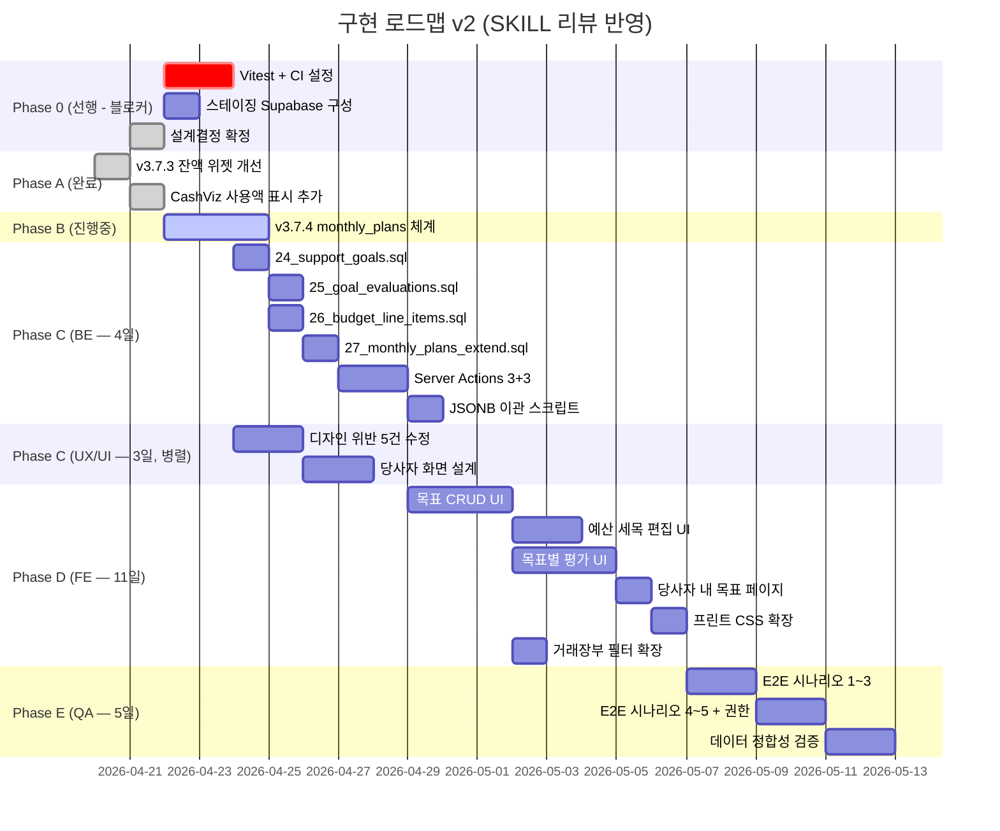
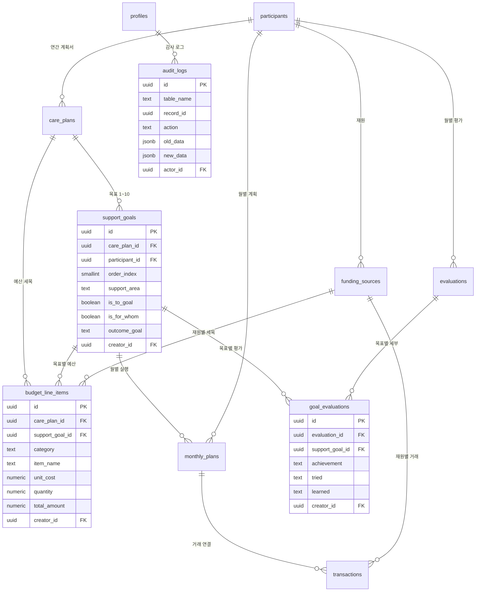

# 계획·평가·예산 데이터 구조 설계 제안서 (v2 — SKILL 리뷰 반영)

> **대상 시스템**: 아름드리꿈터 개인예산 관리 앱 (Personal Budgets App)
> **근거 문서**: [000 개별지원계획서.md](file:///root/workspace/my-project/Personal_Budgets_App/Plan&Source/000%20개별지원계획서.md)
> **작성일**: 2026-04-21 / **개정**: v2 (SKILL 기반 에이전트 팀 리뷰 반영)
> **최종 점검**: 2026-04-21 (Critical 이슈 수정 완료)
> **목적**: Claude Code 에이전트 팀 (PM, BE, FE, PL, QA, UX/UI, DevOps) 에게 전달할 통합 설계 문서

---

## 진행 현황 (2026-04-21 기준)

| Phase | 내용 | 상태 | 커밋 |
|:---:|:---|:---:|:---|
| A | v3.7.3 잔액 위젯 개선 (피자/물컵 중앙 금액, pending 점선) | ✅ 완료 | `a9d741f` |
| A | CashViz 지폐 간격 확대 + "이미 쓴 돈" 섹션 가시성 강화 | ✅ 완료 | `e81c78a` |
| B | v3.7.4 monthly_plans 체계 (migration 23 + CRUD + 위젯 연동) | ✅ 완료 | `27ca29e` |
| 0 | Vitest + @testing-library 설치 + CI `npm test` 추가 | ✅ 완료 | 커밋 예정 |
| 0 | 스테이징 Supabase 환경 구성 | ⚠️ 수동 필요 | — |
| C | v3.8.0 support_goals + goal_evaluations + budget_line_items | ⏳ 대기 | — |

> [!NOTE]
> **v2 최종 점검 수정 사항 (2026-04-21)**
> - `creator_id NOT NULL ... ON DELETE SET NULL` 모순 → **`ON DELETE RESTRICT`** 3곳 수정
> - 나머지 Medium/Low 이슈(audit_logs RLS, evaluations 구조, care_plans_backup)는 Phase C BE 착수 시 반영

---

## 0. v1 → v2 주요 변경 이력

> [!IMPORTANT]
> SKILL 기반 에이전트 팀 리뷰 결과 반영

| # | 변경 항목 | 변경 전 (v1) | 변경 후 (v2) | 근거 |
|:---:|:---|:---|:---|:---|
| 1 | `life_balance` 필드 | 단일 TEXT | `is_to_goal` BOOLEAN + `is_for_whom` BOOLEAN 분리 | BE: 정의 불명확 |
| 2 | `goal_evaluations.creator_id` | 선택적 FK | **NOT NULL** + Server Action에서 강제 설정 | BE: 사용자 조작 방지 |
| 3 | `budget_line_items.support_goal_id` ON DELETE | SET NULL | **RESTRICT** | BE: 세목 손실 방지 |
| 4 | §9 설계결정 1~3 | "팀 논의 필요" | **확정** (PL 최종 판단) | PL 조건부 승인 |
| 5 | §9.4 활동사진 연결 | "자동 추론 B" | **초기 A(수동), 2차에서 B** | PL 판단 |
| 6 | Migration 실행 순서 | "24→25→26→27 문서화" | **24 → {25+26 병렬} → 27** FK 강제 | PL+BE |
| 7 | QA 일정 | 3일 | **5일** (5시나리오 × 3권한) | PM |
| 8 | Vitest/Playwright | 미언급 | **Phase 0 선행 필수** | QA 블로커 |
| 9 | 감사 로그 | 미언급 | **audit_log 테이블 추가** (Phase C2) | PM 컴플라이언스 |
| 10 | UX 디자인 위반 | 미언급 | **5건 수정 체크리스트** 명시 | UX/UI |
| 11 | 전체 공수 | 미산정 | **~35 인일** | PM |
| 12 | 스테이징 환경 | 미언급 | **Phase 0 구성 필수** | DevOps |

---

## 1. 현황 분석

*(v1과 동일 — §1.1~§1.3 생략, [v1 제안서](file:///root/.gemini/antigravity/brain/20c139b1-11aa-4308-8ea0-107337ba4bf7/plan_evaluation_budget_proposal.md) 참조)*

---

## 2. 확정된 설계 결정 (PL 최종 판단)

> [!CAUTION]
> 아래 7개 항목은 PL 승인 완료. 추가 논의 없이 구현 착수한다.

| # | 항목 | 최종 결정 | 비고 |
|:---:|:---|:---:|:---|
| 1 | care_plans JSONB → support_goals 이관 | **✅ B: 완전 이관** | 이중 소스 유지 시 API 복잡도 급증 |
| 2 | budget_line_items.total_amount | **✅ B: GENERATED ALWAYS** | Supabase PG15+ 지원 확인됨 |
| 3 | 평가 워크플로우 | **✅ B: 동시 저장** | 트랜잭션 처리 필수 |
| 4 | 활동사진 ↔ 목표 연결 | **⚠️ 초기 A(수동)** | 2차에서 자동 추론(B) 도입 |
| 5 | 계획 없는 지출 nullable | **✅ B 유지** | monthly_plan_id NULL 허용 |
| 6 | 연간 목표 최대 | **✅ B: 10개** | 확장성 확보 |
| 7 | 지원 영역 코드화 | **✅ 초기 A(자유 텍스트)** | v4.0에서 enum 도입 |

---

## 3. 제안 데이터 모델 (v2 수정)

### 3.1 `support_goals` — 연간 지원 목표 (BE 수정 반영)

```sql
CREATE TABLE public.support_goals (
  id              UUID PRIMARY KEY DEFAULT gen_random_uuid(),
  care_plan_id    UUID NOT NULL REFERENCES care_plans(id) ON DELETE CASCADE,
  participant_id  UUID NOT NULL REFERENCES participants(id) ON DELETE CASCADE,
  order_index     SMALLINT NOT NULL CHECK (order_index BETWEEN 1 AND 10),
  
  -- §4 컬럼 매핑
  support_area    TEXT NOT NULL,                -- "고용 활동", "평생학습 활동" 등
  -- ✏️ v2: life_balance → 분리 (BE 피드백)
  is_to_goal      BOOLEAN DEFAULT FALSE,       -- 당사자에게 중요한 것 (To)
  is_for_whom     BOOLEAN DEFAULT FALSE,       -- 당사자를 위해 중요한 것 (For)
  needed_support  TEXT,                        -- "필요한 지원"
  outcome_goal    TEXT,                        -- "성과 및 산출 목표"
  strategy        TEXT,                        -- "전략계획(누가, 언제, 어떻게)"
  linked_services TEXT,                        -- "연계 가능한 지원"
  
  -- §6 평가 도구 참조
  eval_tool       TEXT,                        -- 평가 도구 설명
  eval_target     TEXT,                        -- 목표치
  
  is_active       BOOLEAN DEFAULT TRUE,
  -- ✏️ v2: creator_id NOT NULL (BE 피드백) / RESTRICT — 실무자 계정 삭제 방지
  creator_id      UUID NOT NULL REFERENCES profiles(id) ON DELETE RESTRICT,
  created_at      TIMESTAMPTZ DEFAULT NOW(),
  updated_at      TIMESTAMPTZ DEFAULT NOW(),
  
  UNIQUE (care_plan_id, order_index)
);
```

> [!NOTE]
> **v2 변경점**:
> - `life_balance TEXT` → `is_to_goal BOOLEAN` + `is_for_whom BOOLEAN` (명확한 의미 부여)
> - `creator_id` NOT NULL 강제 (Server Action에서 `auth.uid()` 자동 주입)

---

### 3.2 `goal_evaluations` — 목표별 평가 (BE 수정 반영)

```sql
CREATE TABLE public.goal_evaluations (
  id              UUID PRIMARY KEY DEFAULT gen_random_uuid(),
  evaluation_id   UUID NOT NULL REFERENCES evaluations(id) ON DELETE CASCADE,
  support_goal_id UUID NOT NULL REFERENCES support_goals(id) ON DELETE CASCADE,
  
  -- 4+1 평가 프레임워크
  tried           TEXT,
  achievement     TEXT CHECK (achievement IN ('achieved', 'in_progress', 'not_achieved')),
  learned         TEXT,
  satisfied       TEXT,
  dissatisfied    TEXT,
  next_plan       TEXT,
  
  -- 정량 메트릭 (선택)
  target_value    NUMERIC,
  actual_value    NUMERIC,
  
  -- ✏️ v2: creator_id NOT NULL (BE 피드백) / RESTRICT — 실무자 계정 삭제 방지
  creator_id      UUID NOT NULL REFERENCES profiles(id) ON DELETE RESTRICT,
  created_at      TIMESTAMPTZ DEFAULT NOW(),
  updated_at      TIMESTAMPTZ DEFAULT NOW(),
  
  UNIQUE (evaluation_id, support_goal_id)
);
```

---

### 3.3 `budget_line_items` — 예산 세목 (BE 수정 반영)

```sql
CREATE TABLE public.budget_line_items (
  id                UUID PRIMARY KEY DEFAULT gen_random_uuid(),
  care_plan_id      UUID NOT NULL REFERENCES care_plans(id) ON DELETE CASCADE,
  funding_source_id UUID REFERENCES funding_sources(id) ON DELETE SET NULL,
  -- ✏️ v2: ON DELETE RESTRICT (BE 피드백 — 세목 및 집행 데이터 보호)
  support_goal_id   UUID REFERENCES support_goals(id) ON DELETE RESTRICT,
  
  category          TEXT NOT NULL,
  item_name         TEXT NOT NULL,
  
  unit_cost         NUMERIC NOT NULL DEFAULT 0,
  quantity          NUMERIC NOT NULL DEFAULT 1,
  unit_label        TEXT,
  calculation_note  TEXT,
  total_amount      NUMERIC GENERATED ALWAYS AS (unit_cost * quantity) STORED,
  
  order_index       SMALLINT DEFAULT 1,
  -- RESTRICT — 실무자 계정 삭제 방지
  creator_id        UUID NOT NULL REFERENCES profiles(id) ON DELETE RESTRICT,
  created_at        TIMESTAMPTZ DEFAULT NOW(),
  updated_at        TIMESTAMPTZ DEFAULT NOW()
);
```

---

### 3.4 `monthly_plans` 확장 (v1과 동일)

```sql
ALTER TABLE public.monthly_plans
  ADD COLUMN IF NOT EXISTS support_goal_id UUID REFERENCES support_goals(id) ON DELETE SET NULL;

ALTER TABLE public.monthly_plans
  ADD COLUMN IF NOT EXISTS activity_photos TEXT[] DEFAULT '{}';

ALTER TABLE public.monthly_plans
  ADD COLUMN IF NOT EXISTS staff_notes TEXT;

CREATE INDEX IF NOT EXISTS idx_monthly_plans_support_goal
  ON public.monthly_plans (support_goal_id);
```

---

### 3.5 (신규) `audit_logs` — 감사 로그 (PM 컴플라이언스)

> [!WARNING]
> 개별지원계획서는 법적 구속력이 있으며, 수정 이력 추적이 필요합니다.

```sql
CREATE TABLE public.audit_logs (
  id          UUID PRIMARY KEY DEFAULT gen_random_uuid(),
  table_name  TEXT NOT NULL,                                   -- 'support_goals', 'budget_line_items' 등
  record_id   UUID NOT NULL,                                   -- 대상 레코드 ID
  action      TEXT NOT NULL CHECK (action IN ('insert', 'update', 'delete')),
  old_data    JSONB,                                           -- 변경 전 데이터
  new_data    JSONB,                                           -- 변경 후 데이터
  actor_id    UUID NOT NULL REFERENCES profiles(id),           -- 변경 수행자
  created_at  TIMESTAMPTZ DEFAULT NOW()
);

CREATE INDEX IF NOT EXISTS idx_audit_logs_table_record
  ON public.audit_logs (table_name, record_id);
CREATE INDEX IF NOT EXISTS idx_audit_logs_actor
  ON public.audit_logs (actor_id);
```

> [!TIP]
> Phase C2 에서 도입. 초기엔 Server Action 레벨에서 INSERT만 수행(트리거 미사용). 
> 향후 PG 트리거로 자동화 가능.

---

## 4. Migration 실행 순서 (PL+BE+DevOps 합의)



> [!CAUTION]
> **순서 강제**: 24가 먼저 실행되어야 25/26의 FK 참조 가능. 25+26은 병렬 가능. 27은 24 이후.

---

## 5. 에이전트 팀별 작업 범위 (v2 — 공수 반영)

### 5.0 Phase 0: 선행 작업 (착수 전 필수) — 2.5일

> [!CAUTION]
> 아래 3건이 해결되지 않으면 Phase C 착수 불가 (QA+DevOps 블로커)

| # | 작업 | 담당 | 공수 | 상태 |
|:---:|:---|:---:|:---:|:---:|
| 0-1 | §9 설계결정 1~3 확정 | 전체 | 0.5일 | ✅ v2에서 확정 |
| 0-2 | Vitest + Playwright 설치 + CI `npm test` 추가 | DevOps | 1.5일 | ❌ 미완 |
| 0-3 | 스테이징 Supabase 환경 구성 | DevOps | 0.5일 | ❌ 미완 |

---

### 5.1 PM — 1일

- [x] ~~§9 설계결정 1~3 확정~~ (v2에서 확정)
- [ ] QA Phase E 일정 4~5일로 재조정 (5 시나리오 × 3 권한)
- [ ] "목표 없는 지출"의 보고서 상 처리 방식 명확화
  - monthly_plan_id NULL 거래 → 보고서에 "기타 / 계획 외" 섹션으로 분류
- [ ] 감사 로그(audit_log) 컴플라이언스 계획 수립

---

### 5.2 BE — 4일 (3~4일 → 4일 확정)

- [ ] Migration SQL 4건 생성 (§4 참조)
  - `24_support_goals.sql` — `is_to_goal` / `is_for_whom` BOOLEAN 분리
  - `25_goal_evaluations.sql` — `creator_id NOT NULL`
  - `26_budget_line_items.sql` — `support_goal_id ON DELETE RESTRICT`
  - `27_monthly_plans_extend.sql`
- [ ] RLS 정책 (기존 23번 패턴 복제)
- [ ] `set_updated_at()` 트리거 4개 테이블 연결
- [ ] Server Actions 신규 3개 + 수정 3개
  - **모든 Action에서 `creator_id = auth.uid()` 강제 설정**
- [ ] care_plans JSONB → support_goals 이관 스크립트
- [ ] `npm run generate-types` 재생성

---

### 5.3 FE — 11일

#### RSC vs Client 분류 (v2 추가)

| 컴포넌트 | 형태 | 이유 |
|:---|:---:|:---|
| `SupportGoalsForm` | `'use client'` | 폼 상태 관리 |
| `BudgetLineItemsTable` | `'use client'` | 인라인 계산기 실시간 반응 |
| `GoalEvaluationCards` | `'use client'` | 4+1 탭/아코디언 인터랙션 |
| `/my-plan` 당사자 목표 | **RSC** | 서버에서 권한 검증 + 조회만 |
| `MonthlyPlanMiniProgress` | `'use client'` | 기존 유지 |

#### 작업 목록

- [ ] `SupportGoalsForm` — 목표 CRUD (3일)
- [ ] `BudgetLineItemsTable` — 산출내역 편집 + 인라인 계산기 (2일)
- [ ] `GoalEvaluationCards` — 4+1 평가 카드 (3일)
- [ ] monthly_plans 편집에 `support_goal` 드롭다운 (0.5일)
- [ ] 거래장부 `support_goal` 간접 필터 (0.5일)
- [ ] 당사자 `/my-plan` 읽기 전용 (1일)
- [ ] 프린트 CSS 확장 (1일)

---

### 5.4 UX/UI — 3일 (v2 추가 — 디자인 시스템 위반 5건 수정)

> [!WARNING]
> UX/UI 리뷰에서 발견된 5건의 디자인 시스템 위반을 반드시 수정해야 합니다.

| # | 위반 사항 | 수정 방향 | 우선순위 |
|:---:|:---|:---|:---:|
| 1 | 예산 계산기 +−×÷ 아이콘 단독 사용 | **텍스트 레이블 필수** ("추가", "삭제", "곱하기") | P0 |
| 2 | 삭제 확인 모달 미명시 | **"정말 삭제하시겠어요? 되돌릴 수 없어요."** 확인 모달 필수 | P0 |
| 3 | 평가 체크박스 색상 대비 미검증 | 달성(초록)/진행중(파랑)/미달성(회색) + **색맹 고려 아이콘 병행** (✓/▶/—) | P1 |
| 4 | 보조 텍스트 12sp → 14sp | 최소 **14sp** 상향 | P1 |
| 5 | 줄 간격 1.3배 → 1.6배 | **line-height: 1.6** 전역 통일 | P1 |

#### 당사자 화면 우선순위 (UX/UI 확정)

| 우선순위 | 화면 | 핵심 규격 |
|:---:|:---|:---|
| 상 | 내 목표 읽기 전용 | 이모지 32px + **24sp Bold** + 진행바 |
| 중 | 활동 사진 업로드 | 3장 제한, **48px 터치 영역** |
| 하 | 자기결정 권리 평가 시각화 | 후속 |

> [!TIP]
> 신규 3개 화면 모두 **카드 기반 수직 레이아웃** 통일 → 인지 부하 50% 감소 (UX/UI 권장)

---

### 5.5 QA — 5일 (v1의 3일 → v2 5일)

#### 🔴 P0 블로커 (배포 불가)

| # | 블로커 | 해결 방법 | 공수 |
|:---:|:---|:---|:---:|
| Q1 | Vitest/Playwright 미설치 | Phase 0에서 설치 + CI `npm run test` 추가 | 1.5일 |
| Q2 | Migration 24~27 SQL 미생성 | BE가 Phase C에서 생성 | — |
| Q3 | 이관 스크립트 미작성 | BE가 care_plans JSONB → support_goals 스크립트 작성 | — |

#### E2E 테스트 시나리오 (5 × 3 권한)

| # | 시나리오 | admin | supporter | participant |
|:---:|:---|:---:|:---:|:---:|
| 1 | 계획서 → 목표 5개 → 세목 등록 | ✅ CRUD | ✅ CRUD | ❌ 리다이렉트 |
| 2 | 월별 계획 → 목표 매핑 → 거래 | ✅ | ✅ | 🔒 읽기전용 |
| 3 | 월별 평가 → 목표별 4+1 → AI | ✅ | ✅ | ❌ 리다이렉트 |
| 4 | 홈 위젯 목표 진행률 | ✅ | ✅ | ✅ 읽기전용 |
| 5 | 권한 우회 접근 차단 | ✅ | ✅ | ✅ 검증 | 

#### 데이터 정합성 자동 검증 쿼리 (v2 추가)

```sql
-- 1. 예산 합계 불일치 감지
SELECT c.id, fs.id, SUM(bli.total_amount) AS line_total, fs.yearly_budget
FROM care_plans c
LEFT JOIN budget_line_items bli ON c.id = bli.care_plan_id
LEFT JOIN funding_sources fs ON bli.funding_source_id = fs.id
GROUP BY c.id, fs.id
HAVING SUM(bli.total_amount) <> fs.yearly_budget;

-- 2. Orphan 목표 평가 (부모 목표 삭제된 평가)
SELECT ge.id FROM goal_evaluations ge
WHERE NOT EXISTS (SELECT 1 FROM support_goals sg WHERE sg.id = ge.support_goal_id);

-- 3. NULL monthly_plan 거래 모니터링 (계획 외 지출)
SELECT COUNT(*) AS unplanned_tx_count 
FROM transactions 
WHERE monthly_plan_id IS NULL AND date >= DATE_TRUNC('month', CURRENT_DATE);

-- 4. care_plans JSONB 이관 검증 (이관 후)
SELECT cp.id, cp.plan_year,
  (cp.content->>'service_plan' IS NOT NULL) AS has_legacy_goals,
  COUNT(sg.id) AS migrated_goals
FROM care_plans cp
LEFT JOIN support_goals sg ON sg.care_plan_id = cp.id
GROUP BY cp.id, cp.plan_year
HAVING (cp.content->>'service_plan' IS NOT NULL) AND COUNT(sg.id) = 0;
```

---

### 5.6 DevOps — 4일

#### 🔴 블로커 해결 (Phase 0)

| # | 블로커 | 해결 | 공수 |
|:---:|:---|:---|:---:|
| D1 | Vitest 미포함 | `npm i -D vitest @testing-library/react` + CI 스텝 | 1일 |
| D2 | 스테이징 Supabase 없음 | 무료 프로젝트 생성 + `.env.staging` | 0.5일 |
| D3 | CI 테스트 스텝 없음 | GitHub Actions에 `npm run test --run` 추가 | 0.5일 |

#### 롤백 계획 (v2 추가)

| Migration | 롤백 방법 | 데이터 손실 위험 |
|:---|:---|:---:|
| 24 (support_goals) | `DROP TABLE support_goals CASCADE` | ⚠️ 목표 데이터 |
| 25 (goal_evaluations) | `DROP TABLE goal_evaluations CASCADE` | ⚠️ 평가 데이터 |
| 26 (budget_line_items) | `DROP TABLE budget_line_items CASCADE` | ⚠️ 세목 데이터 |
| 27 (monthly_plans 확장) | `ALTER TABLE DROP COLUMN` × 3 | LOW |

> [!CAUTION]
> 배포 전 Supabase 수동 스냅샷 필수 (무료 티어 주 1회).
> RLS 정책 변경은 **반드시 스테이징에서 먼저 검증**.

---

## 6. 공수 총괄 (v2 재산정)

| Phase | 역할 | 공수 | 의존성 |
|:---:|:---|:---:|:---|
| 0 | DevOps | 2.5일 | — (선행) |
| C | BE | 4일 | Phase 0 완료 |
| C | FE (병렬) | 11일 | BE Migration + Actions 완료 후 |
| C | UX/UI (병렬) | 3일 | 독립 |
| E | QA | 5일 | FE 완료 후 |
| — | PM (지속) | 1일 | 전 구간 |
| | **총합** | **~35 인일** | |



---

## 7. "목표 없는 지출" 보고서 처리 (PM 요청 — v2 추가)

`transactions.monthly_plan_id = NULL` 인 거래의 보고서 처리:

| 필드 | 표시 방식 |
|:---|:---|
| 계획명 | "기타 / 계획 외 지출" |
| 목표 영역 | "미지정" |
| 예산 집행률 | — (별도 집계 제외, 총액에만 포함) |
| 필터 | 거래장부 "계획" 필터에서 "계획 없음" 옵션으로 노출 |
| 프린트 | 예산 집행 내역표 하단 "기타 지출" 섹션에 합산 표시 |

---

## 8. 이관 리스크 관리 (QA 경고 반영)

> [!WARNING]
> care_plans JSONB → support_goals 이관 시 `order_index` 손실 가능 → **HIGH** 리스크

### 이관 절차

```
1. [백업] 모든 care_plans 레코드를 별도 테이블에 복사
2. [분석] JSONB content 내 service_plan 배열 파싱 → order_index 자동 부여 (배열 순서)
3. [이관] support_goals INSERT (care_plan_id, participant_id, order_index, ...)
4. [검증] §5.5 정합성 쿼리 4번 실행 — has_legacy_goals=true AND migrated_goals=0 → FAIL
5. [정리] 검증 통과 시 care_plans.content 에서 service_plan 키 제거
6. [확인] 이관 전후 목표 수 비교 보고서 출력
```

### Rollback

```sql
-- 이관 실패 시: support_goals 초기화 + care_plans.content 백업 복원
TRUNCATE support_goals CASCADE;
UPDATE care_plans SET content = backup.content
FROM care_plans_backup backup
WHERE care_plans.id = backup.id;
```

---

## 9. RLS 보안 강화 (PL 요청 — v2 추가)

### monthly_plans.support_goal_id NULL 시 RLS 명시

> [!WARNING]
> `support_goal_id` NULL인 monthly_plans 에서 참여자 권한 우회 가능성

```sql
-- 기존 RLS 보강: 참여자는 반드시 본인 participant_id 일치 확인
CREATE POLICY "monthly_plans_participant_own" ON public.monthly_plans
  FOR SELECT TO authenticated
  USING (
    participant_id = auth.uid()
    OR EXISTS (
      SELECT 1 FROM public.profiles
      WHERE profiles.id = auth.uid()
        AND profiles.role IN ('admin', 'supporter')
    )
  );
```

> [!NOTE]
> support_goal_id가 NULL이어도 participant_id 기준 RLS가 적용되므로 안전.
> 기존 migration 23의 정책과 동일 패턴이나, 명시적으로 재확인.

---

## 10. 기존 자산 재사용 + 신규 패턴

| 자산 | 위치 | 재사용 | v2 추가 사항 |
|:---|:---|:---|:---|
| `formatCurrency` | `budget-visuals.ts` | 전역 | — |
| `EasyTerm` | `EasyTerm.tsx` | 전역 | — |
| RLS 패턴 | `23_monthly_plans.sql` | 4개 테이블 복제 | NULL FK RLS 명시 |
| `set_updated_at()` 트리거 | 기존 | 4개 테이블 연결 | — |
| 집계 쿼리 패턴 | `monthlyPlan.ts` | `getGoalProgress` | budget_line_items JOIN 추가 |
| **삭제 확인 모달** | — | **신규 공통 컴포넌트** 필요 | UX#2 |
| **색맹 아이콘** | — | 체크/진행/미달성 아이콘 세트 | UX#3 |

---

## 부록 A: 전체 ER 다이어그램 (v2 — audit_logs 추가)



---

## 부록 B: 즉시 실행 체크리스트 (착수 전)

- [x] §9 설계결정 1~7 확정 (v2에서 PL 승인)
- [ ] Vitest + @testing-library/react 설치
- [ ] GitHub Actions CI에 `npm run test --run` 스텝 추가
- [ ] 스테이징 Supabase 프로젝트 생성 + `.env.staging`
- [ ] Migration 24~27 SQL 파일 생성 (BE)
- [ ] care_plans JSONB 이관 SQL 스크립트 초안 (BE)
- [ ] UX 위반 5건 디자인 명세 업데이트 (UX/UI)

**위 체크리스트 완료 후 Phase C 정식 착수**
